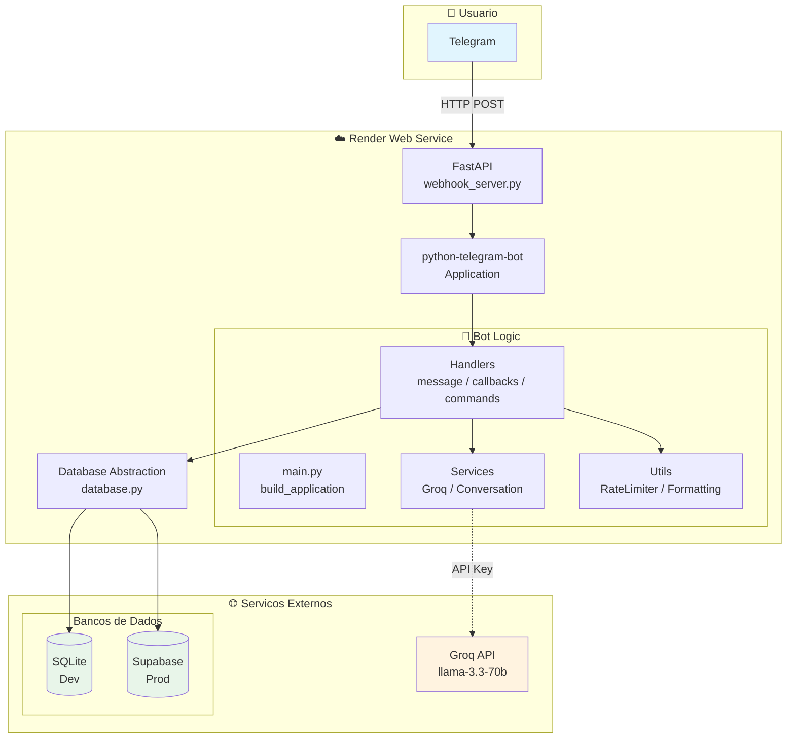

# LinguaBot 🎓 — English Teacher Telegram Bot

Assistente pessoal de ingles via Telegram para falantes de portugues brasileiro (nivel A1-A2).
Usa Groq (LLM rapido) para gerar respostas, corrigir erros e ensinar vocabulario novo.

---

## 📋 Indice

- [Sobre](#-sobre)
- [Stack Tecnologica](#-stack-tecnologica)
- [Pre-requisitos](#-pre-requisitos)
- [Setup Local](#-setup-local)
- [Uso](#-uso)
- [Comandos](#-comandos)
- [Deploy no Render](#-deploy-no-render-passo-a-passo)
- [Estrutura do Projeto](#-estrutura-do-projeto)
- [Testes](#-testes)

---

## 📖 Sobre

O **LinguaBot** e um bot do Telegram que atua como professor particular de ingles para brasileiros em nivel iniciante (A1-A2). O bot:

- Mantem **imersao total em ingles** — responde apenas em ingles
- Faz **correcoes contextuais gentis** (max. 1-2 por mensagem)
- Apresenta **vocabulario novo** com traducao e exemplos
- Salva **vocabulario persistente** (SQLite / Supabase) para revisao
- Oferece **botoes interativos**: More Examples, Explain This Word, Practice This
- Sugere **15 topicos** para praticar conversacao
- **Rate limiter** suave: 100 mensagens/dia com avisos

---

## 🛠 Stack Tecnologica

| Camada | Tecnologia |
|--------|-----------|
| **Linguagem** | Python 3.14+ |
| **Bot Framework** | python-telegram-bot 22+ (async) |
| **LLM** | Groq (llama-3.3-70b-versatile) |
| **Webhook Server** | FastAPI + Uvicorn |
| **Banco (dev)** | SQLite |
| **Banco (prod)** | Supabase (PostgreSQL) |
| **Hospedagem** | Render (Web Service, free tier) |
| **Testes** | pytest + mocks (206 testes) |

---

## 🏗 Arquitetura



---

- **Python 3.11+** instalado
- **Conta no Telegram** e um bot criado via [@BotFather](https://t.me/BotFather)
- **Chave de API do Groq** ([console.groq.com/keys](https://console.groq.com/keys))
- (Opcional) **Conta no Render** para deploy

---

## 🚀 Setup Local

### 1. Clone o repositorio

```bash
git clone https://github.com/seu-usuario/english-teacher-bot.git
cd english-teacher-bot
```

### 2. Crie e ative um ambiente virtual

```bash
python -m venv venv

# Windows
venv\Scripts\activate

# Linux/Mac
source venv/bin/activate
```

### 3. Instale as dependencias

```bash
pip install -r requirements.txt
```

### 4. Configure as variaveis de ambiente

```bash
cp .env.example .env
```

Edite o arquivo `.env` com suas chaves:

```env
BOT_TOKEN=seu_token_do_botfather
GROQ_API_KEY=gsk_sua_chave_groq
BOT_MODE=polling
```

### 5. Execute o bot

**Modo polling (recomendado para desenvolvimento):**

```bash
python -m bot.main
```

O bot iniciara em modo **polling** e comecara a responder no Telegram.

**Modo webhook (para testar localmente antes do deploy):**

```bash
uvicorn bot.webhook_server:app --host 0.0.0.0 --port 8000
# ou
python -m bot.webhook_server  # usa fallback para porta 8000
```

Acesse [http://localhost:8000/health](http://localhost:8000/health) para verificar.

> ⚠️ Para testar webhook localmente voce precisa de um tunel como [ngrok](https://ngrok.com/)
> apontando para `localhost:8000` e definir `RENDER_URL` como a URL do ngrok no `.env`.

---

## 📱 Uso

1. Abra o Telegram e procure seu bot (ou use o link do @BotFather)
2. Envie `/start` para ver o menu inicial
3. Comece a conversar! Digite qualquer coisa em ingles (ou portugues — o bot ajuda)
4. Use os botoes abaixo das respostas para:
   - **📝 More Examples** — ver mais exemplos
   - **📖 Explain This Word** — explicacao simples
   - **🎯 Practice This** — mini exercicio

---

## 📋 Comandos

| Comando | Descricao |
|---------|-----------|
| `/start` | Mensagem de boas-vindas + menu inicial |
| `/help` | Lista de comandos + dicas de uso |
| `/reset` | Limpa o historico da conversa e sugere novo topico |
| `/vocab` | Mostra lista de vocabulario aprendido (paginado) |
| `/topic` | Sugere um topico aleatorio para praticar |

---

## 🌐 Deploy no Render (Passo a Passo)

### Visao Geral

O Render e uma plataforma de hospedagem gratuita que aceita apps Python via GitHub.
O bot funciona em modo **webhook**: o Telegram envia mensagens diretamente para o servidor,
mantendo o servico ativo (sem "spin down" do free tier).

### Passo 1: Preparar o repositorio no GitHub

Antes de tudo, seu projeto precisa estar em um repositorio GitHub:

```bash
# No diretorio do projeto:
git init
git add .
git commit -m "Initial commit"
# Crie um repositorio no GitHub e siga as instrucoes para conectar
git remote add origin https://github.com/seu-usuario/lingua-bot.git
git push -u origin main
```

> ⚠️ **Importante**: O `.gitignore` ja inclui `.env` e arquivos de banco de dados.
> Nao suba suas chaves secretas para o GitHub!

### Passo 2: Criar Web Service no Render

1. Acesse [dashboard.render.com](https://dashboard.render.com/)
2. Clique em **"New +"** > **"Web Service"**
3. Conecte sua conta do GitHub e selecione o repositorio `lingua-bot`
4. Preencha as configuracoes:

| Configuracao | Valor |
|---|---|
| **Name** | `lingua-bot` (ou outro nome unico) |
| **Runtime** | `Python 3` (detecta automaticamente) |
| **Build Command** | `pip install -r requirements.txt` |
| **Start Command** | `uvicorn bot.webhook_server:app --host 0.0.0.0 --port $PORT` |
| **Plan** | **Free** |

### Passo 3: Configurar Variaveis de Ambiente

Ainda na pagina de criacao, role ate **Environment Variables** e adicione:

| Variavel | Valor | Obrigatoria? |
|---|---|---|
| `BOT_TOKEN` | Seu token do Telegram (de @BotFather) | ✅ Sim |
| `GROQ_API_KEY` | Sua chave do Groq (de console.groq.com) | ✅ Sim |
| `BOT_MODE` | `webhook` (obrigatorio para Render) | ✅ Sim |
| `RENDER_URL` | `https://lingua-bot.onrender.com` (substitua pelo nome do seu app) | ✅ Sim |
| `GROQ_MODEL` | `llama-3.3-70b-versatile` (ou outro modelo) | ❌ Opcional |
| `DAILY_LIMIT` | `100` (limite de mensagens/dia) | ❌ Opcional |
| `MAX_HISTORY_TURNS` | `15` (historico da conversa) | ❌ Opcional |
| `SUPABASE_URL` | URL do Supabase (para banco persistente) | ❌ Opcional |
| `SUPABASE_KEY` | Chave do Supabase | ❌ Opcional |

> ⚠️ **Atencao**: `RENDER_URL` e CRITICO! Sem ele, o bot nao consegue registrar o webhook no Telegram.
> Substitua `lingua-bot` pelo nome exato que voce usou no campo **Name** acima.

### Passo 4: Deploy

Clique em **"Create Web Service"**. O Render vai:

1. Clonar seu repositorio
2. Instalar as dependencias (`pip install -r requirements.txt`)
3. Iniciar o servidor com `uvicorn bot.webhook_server:app`

Apos alguns segundos, voce vera os logs:

```
Webhook configurado: https://lingua-bot.onrender.com/webhook | Pendente: 0
```

Isso significa que o webhook foi registrado com sucesso no Telegram!

### Passo 5: Verificar se esta funcionando

**Health check**: Acesse no navegador:
```
https://lingua-bot.onrender.com/health
```

Resposta esperada:
```json
{
  "status": "ok",
  "service": "lingua-bot",
  "webhook_url": "https://lingua-bot.onrender.com/webhook",
  "pending_updates": 0,
  "bot_username": "@SeuBot"
}
```

**Teste no Telegram**: Envie `/start` para o seu bot. Ele deve responder em alguns segundos.

### Passo 6: Deploy de atualizacoes

Toda vez que voce fizer `git push` para o branch principal (`main` ou `master`),
o Render automaticamente faz deploy da nova versao. Para deploy manual:

1. Va no [dashboard do Render](https://dashboard.render.com/)
2. Clique no seu servico `lingua-bot`
3. Clique em **"Manual Deploy"** > **"Deploy Latest Commit"**

### ⚠️ Troubleshooting

| Problema | Causa provavel | Solucao |
|---|---|---|
| `RENDER_URL nao configurada!` | Faltou definir `RENDER_URL` no ambiente | Adicione a variavel no Render |
| `Webhook configurado: None` | `RENDER_URL` esta errada | Verifique se a URL corresponde ao nome do app |
| Bot nao responde | Webhook nao registrado | Veja os logs do Render |
| `401 Unauthorized` | `BOT_TOKEN` invalido | Gere um novo token no @BotFather |
| `API key not valid` | `GROQ_API_KEY` invalida | Gere nova chave em [console.groq.com/keys](https://console.groq.com/keys) |
| Erro 500 no /webhook | Erro interno no processamento | Veja os logs do Render para detalhes |

### 🔄 Como funciona o webhook

O `webhook_server.py` faz tudo automaticamente:

1. **Ao iniciar**: Importa `build_application()` de `main.py` (mesma config do polling)
2. **Startup**: Chama `application.initialize()` e registra o webhook via `set_webhook()`
3. **Durante operacao**: Cada mensagem do Telegram chega como POST em `/webhook`
4. **Shutdown**: Finaliza o application do PTB

Nao precisa usar curl ou chamar a API do Telegram manualmente — o bot se auto-registra.

### 📝 Alternativa: Verificar webhook manualmente

Caso queira confirmar o webhook pelo terminal:

```bash
curl https://api.telegram.org/botSEU_TOKEN_AQUI/getWebhookInfo
```

Resposta esperada:
```json
{
  "ok": true,
  "result": {
    "url": "https://lingua-bot.onrender.com/webhook",
    "has_custom_certificate": false,
    "pending_update_count": 0
  }
}
```

---

## 📁 Estrutura do Projeto

```
lingua-bot/
├── .env.example              # Template de variaveis de ambiente
├── .gitignore
├── Procfile                  # Render: comando de inicializacao
├── README.md                 # Este arquivo
├── requirements.txt          # Dependencias Python
├── runtime.txt               # Versao do Python para o Render
├── bot/
│   ├── __init__.py
│   ├── main.py               # Entrypoint — polling (dev) e build_application()
│   ├── config.py             # Carrega variaveis de ambiente
│   ├── database.py           # Abstracao de BD (SQLite / Supabase)
│   ├── webhook_server.py     # Servidor FastAPI para webhook (Render)
│   ├── handlers/
│   │   ├── __init__.py
│   │   ├── start.py          # /start — boas-vindas + menu
│   │   ├── help.py           # /help — instrucoes e comandos
│   │   ├── message.py        # Conversacao com Groq + extracao de vocab
│   │   ├── commands.py       # /reset, /vocab, /topic
│   │   ├── callbacks.py      # Botoes inline (More Examples, etc.)
│   │   └── error_handler.py  # Tratamento global de erros
│   ├── services/
│   │   ├── __init__.py
│   │   ├── groq.py           # Integracao com Groq API
│   │   └── conversation.py   # Gerenciamento de contexto
│   └── utils/
│       ├── __init__.py
│       ├── formatting.py     # Formatacao de texto, topicos, vocabulario
│       ├── keyboards.py      # Menus e botoes inline
│       └── rate_limiter.py   # Limite suave de 100 msg/dia
└── tests/
    ├── __init__.py
    ├── conftest.py            # Fixtures e mocks compartilhados
    ├── test_conversation.py   # Testes do ConversationManager (11 testes)
    ├── test_rate_limiter.py   # Testes do RateLimiter (10 testes)
    ├── test_formatting.py     # Testes de formatacao e extracao (16 testes)
    ├── test_groq.py           # Testes do GroqService mockado (11 testes)
    ├── test_commands.py       # Testes de /reset, /vocab, /topic (6 testes)
    ├── test_callbacks.py      # Testes de botoes inline (31 testes)
    ├── test_message.py        # Testes do message handler (24 testes)
    ├── test_database.py       # Testes do SQLite e Supabase (21 testes)
    └── test_webhook_server.py # Testes do servidor webhook (8 testes)
```

---

## 🧪 Testes

O projeto possui **206 testes unitarios** com pytest:

```bash
# Rodar todos os testes
python -m pytest tests/ -v

# Rodar com cobertura (se tiver pytest-cov instalado)
python -m pytest tests/ --cov=bot -v

# Rodar teste especifico
python -m pytest tests/test_groq.py -v

# Testar a API do Groq (requer chave real no .env)
python tests/check_groq.py
```

---

Feito com 💙 para ajudar brasileiros a aprender ingles.
